# ⚡ Windows AD Remote Administration Control Center — Enterprise Remote Control & Administration Suite

[](https://github.com/SuperUser-exe/Windows-Active-Directory-Remote-Administration-Control-Center/releases)
[](https://microsoft.com)
[](https://dotnet.microsoft.com)
[](LICENSE)
[](README.md)
[](https://t.me/WADRACC)

> **Created & Developed by [Askarali Mattummal]** | **[GitHub](https://github.com/SuperUser-exe)** | **[Telegram](https://t.me/WADRACC)**  
> *A high-performance, 100% agentless Windows & Active Directory remote management, screen mirroring, diagnostics, and IT helpdesk suite.*

---

<p align="center">
  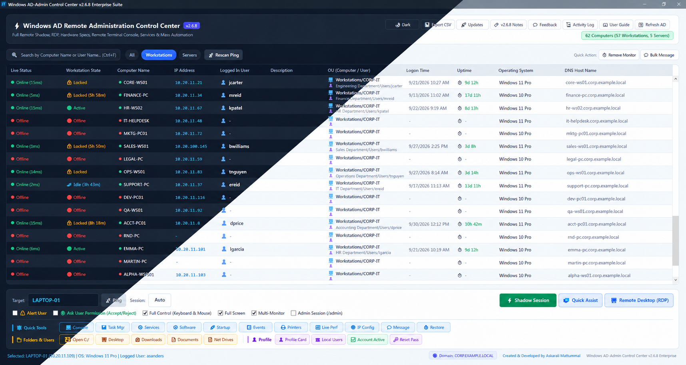
</p>

---

## 👋 Welcome to Windows AD Remote Administration Control Center!

### 💡 Background, Motivation & Why I Created This
As a systems engineer managing active enterprise Active Directory environments, I frequently found myself frustrated by the constant friction of daily IT administration. Performing routine support tasks meant constantly switching between a dozen separate tools:
- Opening **Active Directory Users & Computers (ADUC)** just to unlock an account or check a user's department and group memberships;
- Launching multiple **MMC snap-ins** (Computer Management, Services, Event Viewer, Print Management);
- Opening command prompts for `shadow.exe`, `net use`, `ipconfig`, `gpupdate`, or PowerShell remoting;
- Relying on heavy, commercial remote support tools that require background client services, third-party cloud relays, and expensive recurring licenses.

To solve this, I originally designed and built **Windows AD Remote Administration Control Center** as my own personal, all-in-one administrative workstation console. My goal was simple: **a single, blazing-fast, lightweight, portable executable (~580 KB) that connects directly to domain computers using native Windows protocols (LDAP, WMI, RPC, SMB, Terminal Services) with zero external dependencies and zero agents to install.**

### 🎯 Who Is This Application For?
This suite was crafted specifically for IT professionals, including:
* **Active Directory & Windows Domain Administrators** managing enterprise domain workstations and servers.
* **Systems Engineers & Network Administrators** needing fast remote diagnostics, live hardware telemetry, IP configuration, and event log auditing.
* **IT Helpdesk & Desktop Support Specialists** who need to shadow user sessions instantly, reset passwords, clear print queues, and clean temporary junk without interrupting users.
* **Managed Service Providers (MSPs)** who want a 100% portable, agentless tool that runs from a USB flash drive or secure administrative share.

### 🌍 Purpose of the Public Release
After colleagues and fellow sysadmin friends used the tool and experienced how much time it saved them daily, they urged me to release it publicly. I decided to publish this project so that the wider IT administration community can benefit from it freely.

---

### 🛡️ Official Release & Authenticity Notice

> [!IMPORTANT]
> The **only official and authentic release source** for this project is:  
> 👉 **https://github.com/SuperUser-exe/Windows-Active-Directory-Remote-Administration-Control-Center**  
> * **Latest Official Release**: **Version 2.7.0** is the current official public release. Next-generation features (such as Desktop Info HUD, God Mode, Idle Agent Service, and Fleet Analytics Intelligence) are now integrated.
> * **Do not trust unofficial copies**: If downloaded from third-party sites, file-sharing platforms, or re-hosted mirrors, the author assumes no responsibility for modified, corrupted, or repackaged binaries.
> * **Integrity Check**: Always verify the official release SHA-256 checksums provided in `CHECKSUMS.txt`.
> * **Community & Discussions**: We have enabled **[GitHub Discussions](https://github.com/SuperUser-exe/Windows-Active-Directory-Remote-Administration-Control-Center/discussions)**! Come say hello, share workflow feedback, report issues, or suggest new features.
> * **Telegram Community Chat**: Join our active Telegram group at **[t.me/WADRACC](https://t.me/WADRACC)** for instant community chat, direct feedback, updates, and IT discussions.

---

## 🧠 How the Application Works & Why It’s a Game Changer

> ### 🚀 *"Try my application once — then tell me how it is! This tool will help you and your IT team 100,000%!"*

### 💡 The Problem with Modern IT Support Tools
Most remote management tools (RMMs) and commercial support platforms force you to install bloated background services on every single computer, set up complex web portals, configure SQL databases, or pay exorbitant monthly subscriptions per endpoint.

### ⚡ The Breakthrough: Pure Native Windows, WMI & Active Directory Power
**Windows AD Remote Administration Control Center** works on a fundamentally different, ultra-lightweight architectural principle:
- **100% Agentless & Fully Portable**: No client software, drivers, or background services are ever installed on managed endpoints. Everything runs on-demand from a single, self-contained portable executable (~600 KB).
- **Background In-Memory Management Engine**: Under the hood, the application executes pure, native Windows management protocols—reading and modifying system properties, LDAP directories, and Windows management APIs directly in memory.
- **Zero Foreign Binaries or Residual Payloads**: There are no temporary batch scripts, remote agents, or third-party background daemons left behind on client computers.
- **Direct RDS Screen Shadowing**: Hooks directly into built-in Windows Terminal Services (`query.exe session` + `mstsc.exe /shadow`), allowing IT administrators to mirror and control user screens in real-time with zero latency—without kicking users off, disturbing their session, or locking their screen.

---

### 🏛️ Under-the-Hood Architecture: How It Actually Works

```text
                        ┌────────────────────────────────────────────────────────┐
                        │   Windows AD Remote Administration Control Center      │
                        │        Single Standalone Portable Executable           │
                        │       Native C# / WPF + In-Memory Windows APIs         │
                        └───────────────────────────┬────────────────────────────┘
                                                    │
         ┌──────────────────────────────────────────┼──────────────────────────────────────────┐
         ▼                                          ▼                                          ▼
 ┌───────────────────────┐                  ┌───────────────────────┐                  ┌───────────────────────┐
 │ Active Directory      │                  │ Workstation & WMI     │                  │ Remote Desktop /      │
 │ (LDAP / ADSI Layer)   │                  │ (CIM & Registry Layer)│                  │ Terminal Services     │
 └───────────┬───────────┘                  └───────────┬───────────┘                  └───────────┬───────────┘
             │ Reads / Writes Direct Attributes         │ Remote Management Pipelines              │ Native Shadow & RDP
             ▼                                          ▼                                          ▼
 ┌───────────────────────┐                  ┌───────────────────────┐                  ┌───────────────────────┐
 │ • User Objects & OU   │                  │ • System Processes    │                  │ • query.exe session   │
 │ • Account Lockouts    │                  │ • Windows Services    │                  │ • mstsc.exe /shadow   │
 │ • Password Resets     │                  │ • Remote Printers     │                  │ • Instant Screen Mirr │
 │ • 40+ User Attributes │                  │ • Remote Registry     │                  │ • No-Kickoff Control  │
 └───────────────────────┘                  └───────────────────────┘                  └───────────────────────┘
```

#### 1. 👤 Active Directory Layer (ADSI / LDAP / Kerberos)
- **Direct Domain Controller Queries**: Communicates directly with domain controllers using native directory services over secure LDAP/Kerberos.
- **Real-Time Attribute Inspection**: Reads user properties dynamically (`lockoutTime`, `badPwdCount`, `userAccountControl`, `pwdLastSet`, `memberOf`, contact metadata, hierarchy).
- **Instant Account Unlocking & Resets**: Unlocks accounts immediately, or triggers secure password resets natively without requiring RSAT on the technician's workstation.

#### 2. ⚙️ Workstation Management & Telemetry Layer (WMI, CIM & Remote Registry)
- **Live Hardware Telemetry**: Queries hardware specifications, active processes, system services, and installed software directly from client systems.
- **Per-Printer Queue Management**: Enumerates printer drivers and inspects remote print jobs, clearing hung documents with precision without affecting other printers.
- **Cross-Profile Software & Drive Auditing**: Inspects system uninstall records and queries all loaded user profiles in `HKEY_USERS` to discover per-user apps (Teams, Zoom, VS Code) and mapped network drives (`Ctrl + D`) even when remote users are idle.
- **Dynamic Profile Path Resolution**: Dynamically discovers the active user's physical profile directory on disk, ensuring wallpaper changes and telemetry overlays apply correctly across all user sessions.

#### 3. 🖥️ Session Layer (Native Windows Remote Desktop Services Shadowing)
- **Console Session Discovery**: Uses native Windows `query.exe session` to instantly detect the logged-in user's active console or RDP session ID.
- **Zero-Lag Hardware Screen Control**: Launches native Microsoft `mstsc.exe /shadow:<id> /control /noConsentPrompt` for zero-lag, hardware-accelerated remote control without installing third-party VNC servers or display capture drivers.

---

### 🚀 Key Highlights
- **🗄️ Fleet Status & Live Activity Stream**: Interactive sidebar Show/Hide toggle (☰ or Ctrl+B) expanding the workspace to full width for maximum density. Real-time **Live Activity Feed** showing fleet events as they happen, scalable up to 5,000 streams with Pause/Start controls for hands-on troubleshooting without losing data.
- **🛡️ Enterprise Security Policy & Multi-Tier Lockout Governance**: Dynamic policy enforcement protecting endpoints across Version Retirement, Workstation Quarantine, and Domain Suspension. Features a streamlined Request Unlock workflow with administrative verification, Granular Scope Lockout Policies with targeted workstation hardware locks, and flexible authorization duration controls.
- **⚡ Sub-Second Cold Startup & Telemetry Persistence**: High-speed caching engine with 24-thread parallel network endpoint scanning; hydrates and verifies 40+ endpoints with real-time green/red statuses and active user accounts in under 1.5 seconds.
- **🚀 Dedicated Quick Assist Remote Assistance Button**: 1-Click launcher for Microsoft Quick Assist positioned in the primary bottom connection bar, featuring the official Microsoft Fluent Quick Assist icon embedded locally as an offline resource (100% functional in air-gapped environments).
- **⏱️ Dedicated Live Uptime Column & Duration Intelligence**: Real-time system uptime column in main inventory grid with instant 1-click numerical sorting by total uptime duration, health color thresholds (green for active, amber for >30 days without reboot), and exact last boot tooltip. Decomposes idle and lock durations into clean, human-readable lowercase units (`13m`, `1h 30m`, `15h 16m`, `17h`, `1d 4h`, `1mo 2d`).
- **⏱️ Inactivity & Idle Monitor Agent in Top Quick Action Toolbar**: 1-Click mass deployment and removal of the endpoint activity monitor directly from the top Quick Action bar (`⏱️ Idle Agent`). Features intelligent skip logic for already-installed hosts, targeted retries for failed/unreachable hosts, dynamic button toggle to `Remove Monitor` when all hosts are active, rich tooltips, and granular diagnostic logging (`[SUCCESS]`, `[SKIPPED]`, `[NO ACCESS]`, `[OFFLINE]`, `[FAILED]`, `[ERROR]`). Accompanied by a 4-tier visual status dot in the main inventory grid (🟢 Green for active, 🟡 Amber for stale telemetry, ⚫ Black for not installed, 🔴 Red for unknown/offline) with dynamic multi-line service diagnostics tooltips.
- **🛡️ System-Level Windows Service & 24/7 Presence Monitoring**: Deployed to the system-managed directory, the agent operates as a native Windows Service starting automatically at Windows boot before any user logs in. It monitors continuous presence 24/7 across all lifecycle states: pre-logon, Windows login screen, active sessions, user lock, user switching, multi-user sign-in/sign-out, and system shutdown. Fully hardened with strict file permissions, hidden from Installed Apps, and protected against unauthorized termination in Task Manager.
- **🔄 1-Minute Lightweight Silent Background Refresh**: Background telemetry engine automatically refreshes Online/Offline status, ping latency, Logged-in User, Active/Idle presence states (`🟢 Active`, `💤 Idle (1h 30m)`, `🔒 Locked (15h 16m)`, `🚪 Logged Off`, `🔴 Offline`), and Idle Agent presence every 60 seconds with an atomic concurrency guard, without clearing the grid or interrupting user typing and selection.
- **📢 In-App Broadcast Studio & Delivery Tracking**: Centrally broadcast urgent alerts and maintenance notifications with end-to-end receipt tracking (Sent ➔ Received ➔ Read ➔ Acknowledged), mandatory acknowledgement mode with dynamic action buttons, and a live fleet receipts audit ledger.
- **💬 Advanced Remote User Messaging Hub**: Enforce exact character limits, Title/Subtitle/XL modes with contextual Large Text font toggle, non-clipping cards, and vibrant multi-icon badge containers.
- **🖨️ Remote Shared & Network Printer Infrastructure & Fleet Audit Manager**: Modern in-window loading splash overlay with live progress, parallel asynchronous query engine, live queued jobs column distinguishing active spooler documents (`⚠️ {N} Pending`) from historical logs (`0`), direct multi-color ink and toner cartridge supply telemetry with recognizable color badges (Cyan, Magenta, Yellow, Black) and standardized 6-tier percentage severity scaling (Good, Low, Very Low, Critical, Empty, and Unknown) with hover detail tooltips and lowest-level column sorting, intelligent underlying network port IP address resolution resolving misnamed ports, clear offline vs unsupported device distinction, adaptive horizontal scrolling and resizable column grids, domain print server test page dispatch, and comprehensive **Per-User Printing Reports & Fleet Consumption Analytics** (automated print server detection with best-accuracy guidance banner and 1-click redirection, real-time interactive multi-filter synchronization across servers, queues, and users, bulk page thresholds, Windows privacy document unmasking guide, dynamic buffer scaling, and executive HTML/CSV export).
- **👥 Active Directory Group Membership Manager**: Live interactive security group management (Add to Group, Remove from Group, Refresh) with built-in primary group safeguards directly from the Profile Card.
- **⚡ Instant Screen Shadowing**: Mirror remote user displays without disconnecting or logging them off.
- **🔔 Modern Pre-Shadow Alerts**: Transmits unobtrusive Action Center Toast notifications near the system clock with sound chimes.
- **🚀 Remote Startup Applications Manager**: Inspect and manage machine and per-profile startup programs, toggle Enable / Disable without deleting entries (`🚀 Startup`).
- **👥 Local Computer Users & Accounts Manager**: Agentless local account management—provision users, reset passwords, toggle active status, and securely delete local users with administrative password confirmation and safeguards (`👥 Local Users`).
- **⏱️ Remote System Restore Point Manager**: Remotely inspect System Restore status on system drives, enable or disable protection, create on-demand checkpoints with custom descriptions, view chronological restore point history, and remotely roll back to previous restore points with automatic reboot confirmation (`⏱️ System Restore`).
- **🗂️ Refined Bottom Administration Category Architecture**: Sleek non-clickable category headers with vertical accent bars clearly demarcating Quick Tools, Folders & Users, and Profile groups for zero click ambiguity.
- **🔑 Windows LAPS & Local Administrator Password Management**: Instant plain-text viewing, countdown badges, rotation, calendar expiration scheduling, and 1-click formatted `.\Administrator` username and full credential copying.
- **📈 Sub-Second Real-Time Live Performance & Hardware Monitor**: High-frequency CPU, RAM, Network (RX/TX), Disk I/O telemetry with historical sparklines, full-screen deep monitoring view with timeline analysis, and integrated hardware specifications, BIOS serial identification, continuous uptime tracker, and logical storage gauges (`📈 Live Perf`).
- **🌐 Remote Network & IP Configuration Hub**: Switch DHCP ⇄ Static IP remotely, One-Click Network Repair & Reset suite (autonomous sequential DNS, ARP, Winsock, TCP/IP stack, adapter reset, and DHCP release/renew), flush DNS, and safe adapter restart (`🌐 IP Config`).
- **🔒 Remote Workstation Lock & Unlock Controller**: Real-time lock screen detection, session locking, console reconnect, and direct session unlock.
- **🗄️ Remote Mapped Drives Manager**: Inspect, add, edit, and disconnect mapped network drives across all remote user profiles with live storage gauges (`Ctrl + D`).
- **💻 Interactive Remote Terminal**: Agentless CMD & PowerShell execution with instant preset commands (`whoami`, `gpupdate`, `sfc`, `ipconfig`).
- **📦 Full Software Inventory**: Multi-architecture scanning across 64-bit and 32-bit registries and all user profiles with automated fallback discovery and silent 1-click uninstaller.
- **📋 Advanced Event Log Viewer & Security Audit Hub**: High-speed reverse streaming and native remote server-side filtering across 14 event channels (including dedicated Group Policy Operational), categorized visual Quick Presets library (35+ enterprise audit presets with colorful badging, emojis, and comprehensive Group Policy / GPUpdate diagnostics), type-to-find search box, forensic entity filtering toolbar (User, Host, IP, and File operations with Exact Match toggle), sortable forensic data columns, vivid severity badges (Audit Success, Audit Failure, Error, Warning, Info, Verbose), event limits up to 10,000 records, rapid emergency pills (including 1-click `📜 GPUpdate`), and 1-click CSV audit export.
- **🖨️ Remote Printers & Queue Manager**: Inspects local and domain print server shared printers with live print job management.
- **👤 Active Directory User Controls**: Dynamic account lockout detection with 1-click unlocking and password resets.
- **🧹 4-Path Deep Temp Cleaner**: Purges Temp, AppData Temp across all profiles, Recent files, and Prefetch in 1-click with byte counters.
- **🖥️ Desktop Info HUD (Sysinternals BgInfo Engine)**: Directly stamp system telemetry onto desktop wallpapers in 2 crisp columns with drop shadows, or launch an optional floating widget (`🖥️ HUD (BgInfo)`).
- **🖼️ Remote Desktop Wallpaper Changer & Manager (Single & Bulk)**: Remotely apply custom background images (JPG, PNG, BMP) across one or multiple remote PCs with display fit styles (Fill, Fit, Stretch, Tile, Center, Span), live image preview, and 1-click original backup restoration.
- **👑 Windows God Mode & Power Tweaks Hub (Single & Bulk)**: Enable or remove Windows Master Control Panel on User & Public Desktop, context menus, and direct admin launcher, plus 1-click power tweaks (Take Ownership, Classic Win11 Menu, Ultimate Performance, CompactOS, Show File Extensions, Disable Telemetry, 1-Click RDP Enable, Disable Bing Search) across single or multiple remote computers.
- **🎯 Dynamic Smart Context Menu (Single vs Bulk)**: Right-clicking multi-selected computers dynamically displays only bulk-supported actions (Wallpaper, God Mode, HUD, Idle Agent, Deep Clean, GPUpdate, Deployer, File Push, Messaging, Power & WOL). Right-clicking a single computer presents the full administrative console with informative messages when features are not configured or supported.
- **🌐 Remote Browser URL & File Launcher**: Launch web URLs in Default Browser, Microsoft Edge, or Google Chrome directly inside the remote user's interactive session.
- **🔄 Seamless In-App Auto-Updater**: Directly updates the application in-place from GitHub Releases without browser redirects or installer wizards!
- **⌨️ Universal Keyboard Ergonomics**: Dismiss any popup window with `ESC`, open Drive Manager with `Ctrl + D`.
---

## 📸 Visual Tour & Application Showcase (Screenshots Gallery)

Explore the rich visual interface and integrated administrative consoles of **Windows AD Remote Administration Control Center**. Every feature is designed for maximum speed, intuitive ergonomics, and comprehensive enterprise visibility.

---

### 1. 🌙 Main Executive Control Center (Dark Theme)
> **Comprehensive Fleet Operations at a Glance**  
> An ultra-dense, dark-mode administrative dashboard designed for low eye-strain during extended monitoring shifts. Displays real-time device ping latency, workstation lock and idle states, active domain users, system uptime, and single-click access to remote shadowing and administrative tools.

<p align="center">
  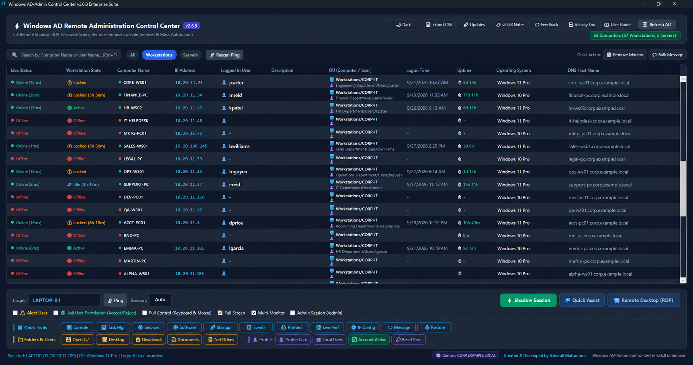
</p>

---

### 2. ☀️ Main Executive Control Center (Light Theme)
> **High-Contrast Daytime Administrative Workspace**  
> A crisp, high-visibility light theme interface offering identical management density and sub-second filtering responsiveness. Features real-time organizational unit hierarchies, rapid workstation categorization, and integrated action triggers.

<p align="center">
  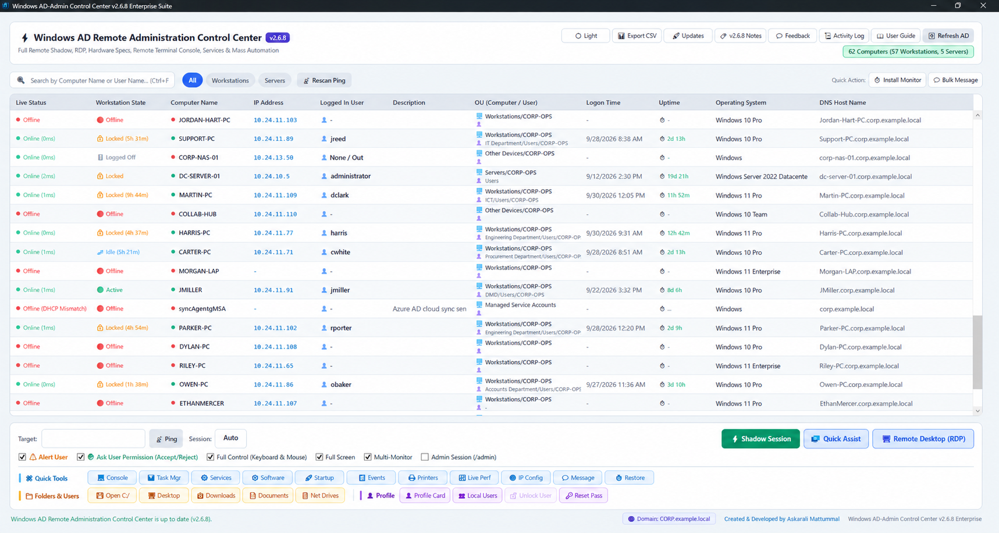
</p>

---

### 3. 🌓 Dual-Theme Adaptive Workspace (Dark & Light Comparison)
> **Zero-Restart Instant Theme Ergonomics**  
> Seamlessly toggle between dark and light color modes with a single click. Designed with tailored color contrast ratios for dark room Network Operations Centers (NOCs) and brightly lit office environments alike.

<p align="center">
  
</p>

---

### 4. 👤 Enterprise 360° Active Directory User Profile Inspector & Editor
> **Complete Directory Object Telemetry & Direct In-Place Attribute Modification**  
> Inspect 40+ Active Directory user attributes across categorized tabs (Identity, Contact, Organization, Security Groups, and Full Text Summary). Perform instant account unlocking, password resets, and in-place LDAP attribute updates without launching external management snap-ins.

<p align="center">
  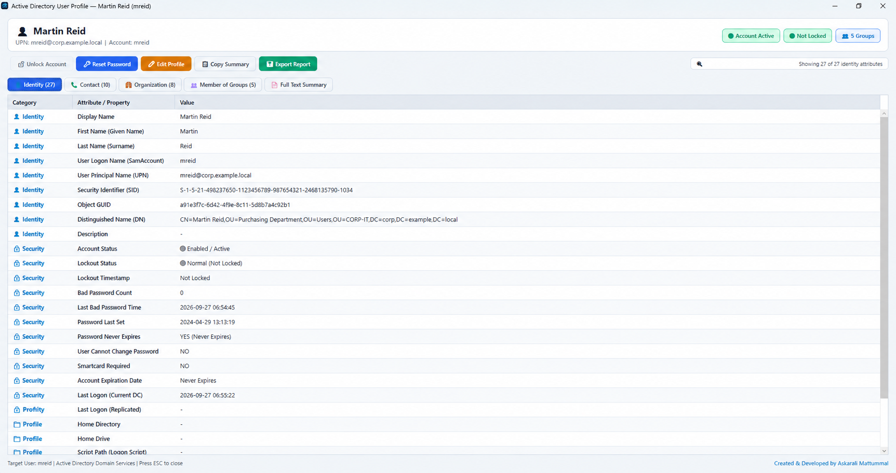
</p>

---

### 5. 📈 Live Workstation Performance & Resource Telemetry
> **High-Frequency Sub-Second Hardware Telemetry & Historical Sparklines**  
> Monitor real-time CPU utilization, physical and available RAM, bi-directional network adapter throughput, and active disk I/O. Features a 60-second rolling trend line graph, live hardware specifications, network adapter details, running processes, and Windows services tabs.

<p align="center">
  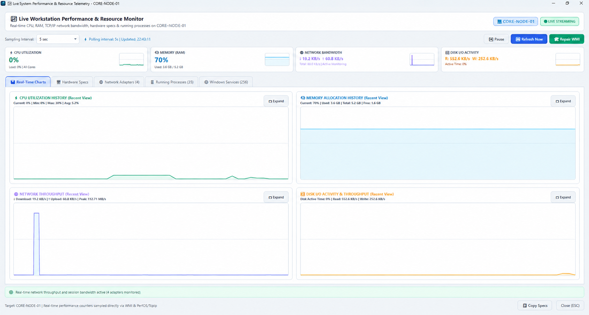
</p>

---

### 6. 💻 Interactive Remote Command Terminal (CMD & PowerShell)
> **Agentless Direct Remote Shell Execution Engine**  
> Run command-line instructions directly against target workstations without installing agents. Equipped with one-click enterprise diagnostic presets (`whoami`, `gpupdate /force`, `ipconfig /all`, `netstat -ano`, `Get-Process`, `Restart Spooler`) and instant export capabilities.

<p align="center">
  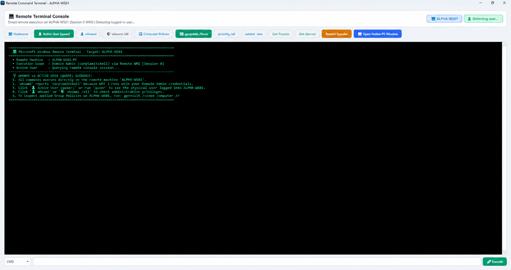
</p>

---

### 7. 📊 Remote Task Manager & Process Controller
> **Granular Process Telemetry & Hung Application Termination**  
> Inspect all running processes across target workstations with live Process IDs (PID), memory consumption footprint, and real-time search filtering. Easily start new tasks, restart processes, or safely terminate unresponsive applications remotely.

<p align="center">
  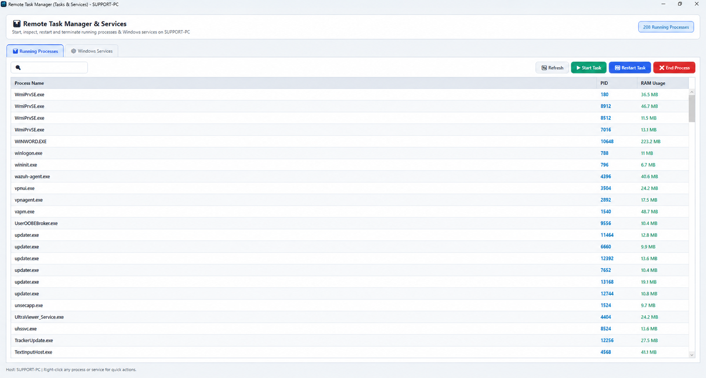
</p>

---

### 8. ⚙️ Remote Windows Services Controller
> **Complete Service Lifecycle & Startup Configuration Management**  
> Enumerate all registered Windows services with live running states, service names, and startup configurations (Automatic, Manual, Disabled). Remotely start, stop, restart services, launch custom service names, and instantly recover hung Print Spoolers.

<p align="center">
  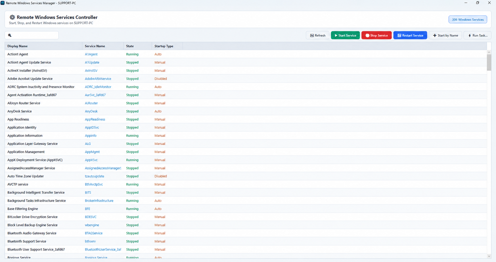
</p>

---

### 9. 📦 Installed Software Inventory & Remote Silent Uninstaller
> **Dual-Architecture Registry & Profile Application Auditing**  
> Audit all installed applications across 64-bit and 32-bit system registries as well as per-user application profiles (Teams, Zoom, OneDrive). Features instant search, application version details, install dates, installer types (MSI/EXE), and one-click silent uninstallation.

<p align="center">
  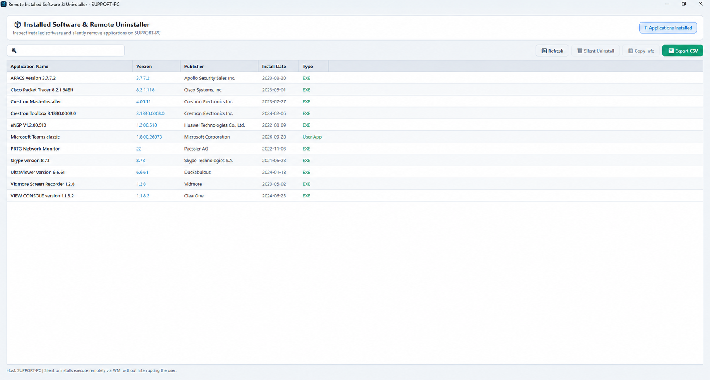
</p>

---

### 10. 🚀 Remote Startup Applications & Autoruns Manager
> **Machine & User Profile Startup Optimization**  
> Audit all startup programs configured in system-wide and user-specific autorun registries and Startup folders. Toggle programs Enabled or Disabled safely without permanently deleting keys, copy command lines, or remove legacy autorun entries.

<p align="center">
  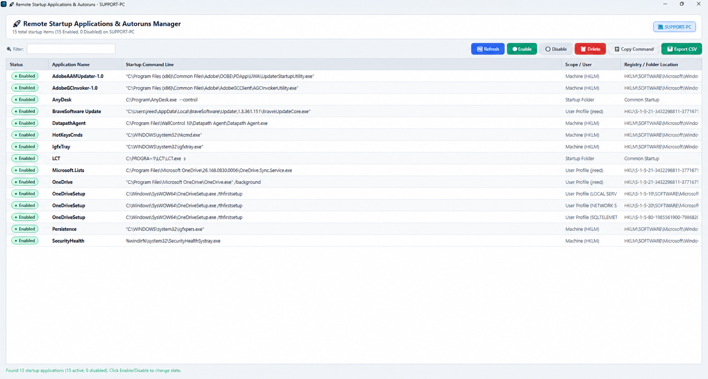
</p>

---

### 11. 👥 Local Computer Users & Security Manager
> **Agentless Local SAM Account Administration & Provisioning**  
> Remotely manage local workstation accounts even when no domain session is active. Create new local administrators or standard users, reset passwords, activate or deactivate accounts, and safely delete accounts with multi-tier administrative password safeguards.

<p align="center">
  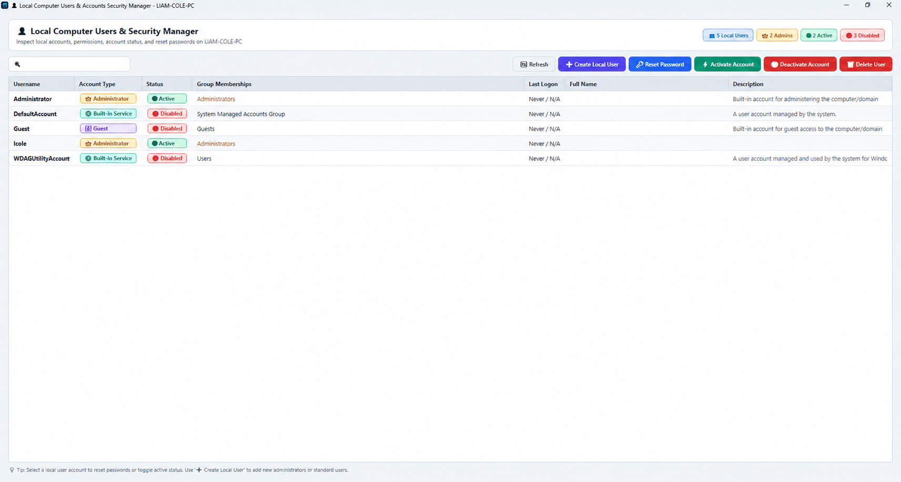
</p>

---

### 12. 🗄️ Remote Mapped Network Drives Manager (`Ctrl + D`)
> **Cross-Profile Network Storage Auditing & Drive Provisioning**  
> Inspect mounted network drives and UNC paths across all loaded user profiles. Add new network drive mappings with automated free letter assignment (Z-D), edit existing mappings, toggle persistent logon reconnection, and disconnect shares with immediate feedback.

<p align="center">
  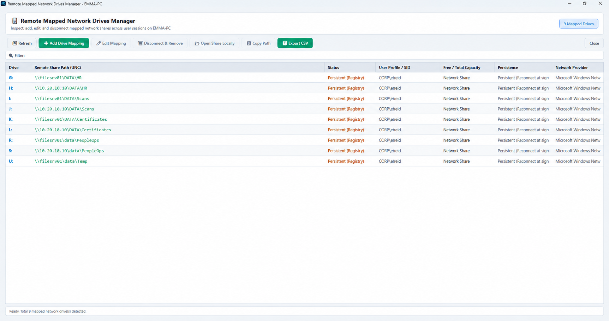
</p>

---

### 13. 🌐 Remote Network Adapter & IP Configuration Hub
> **Safe Remote IP Switching & Autonomous Network Stack Repair**  
> Remotely reconfigure network interfaces between DHCP and Static IP addresses with strict format validation. Execute one-click autonomous network repair routines (flush DNS, register DNS, release/renew DHCP leases, reset adapters, and enable ICMP firewall rules).

<p align="center">
  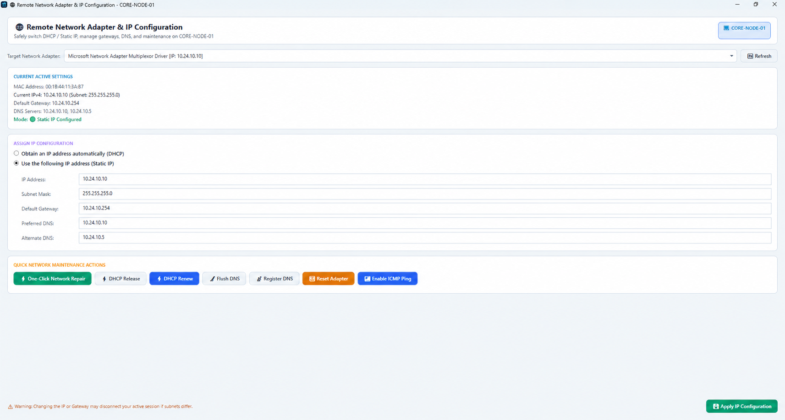
</p>

---

### 14. 🔍 DNS Name Resolution & Reverse Lookup (nslookup)
> **Active Directory Integrated DNS Diagnostics & PTR Validation**  
> Perform forward (A/AAAA) and reverse (PTR) host resolution against domain DNS servers. Verify responding DNS servers, inspect response latencies, flush local DNS caches, and toggle between structured records and raw terminal output.

<p align="center">
  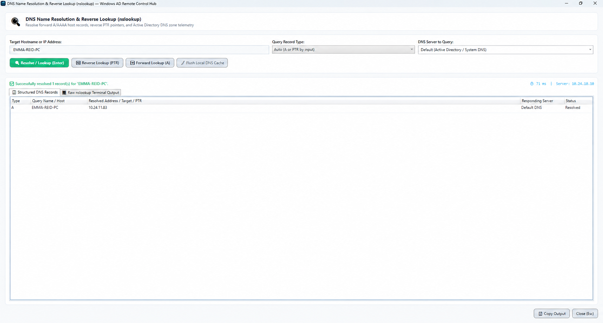
</p>

---

### 15. 🔒 Remote Workstation Lock & Unlock Controller
> **Real-Time Lock Screen Detection & Credential Session Unlock**  
> Accurately detects whether a remote computer is actively locked by an operator. Remotely engage the Windows lock screen, reconnect disconnected physical console sessions, safely log off abandoned sessions, or unlock sessions remotely using authenticated credentials.

<p align="center">
  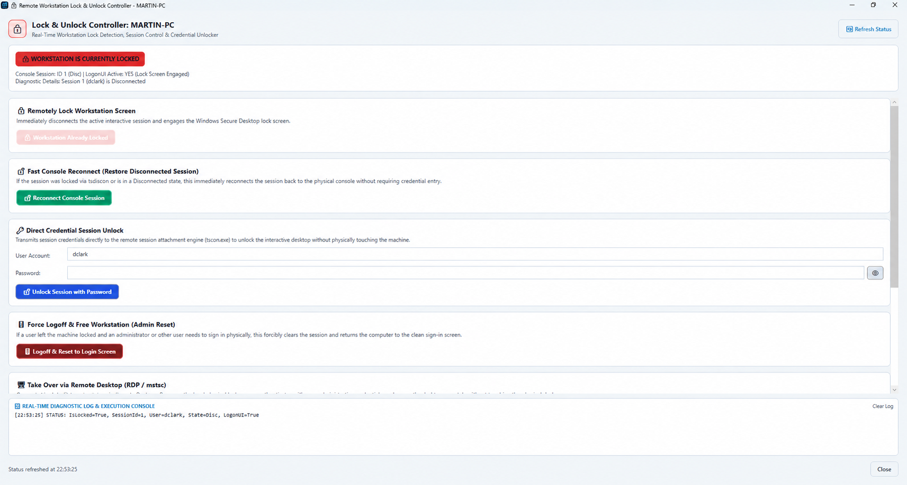
</p>

---

### 16. 🔑 Windows LAPS & Local Administrator Password Management
> **Native Active Directory LAPS Decryption & Expiration Scheduling**  
> Directly decrypt and view Microsoft LAPS managed passwords in plain-text with authorized administrative permissions. Copy credentials in standard formats, view remaining validity countdowns, set custom expiration dates, or force immediate password rotation.

<p align="center">
  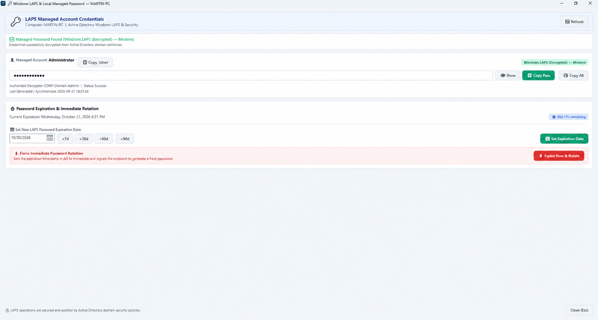
</p>

---

### 17. 🖥️ Desktop Info HUD (Sysinternals BgInfo Wallpaper Engine)
> **Customizable System Telemetry Stamped Directly onto Desktop Backgrounds**  
> Stamp critical system diagnostics (hostname, IP address, OS build, uptime, CPU, RAM, disk space) cleanly onto remote desktop wallpapers in high-contrast two-column drop shadow format. Supports wallpaper overlays, floating desktop companion widgets, or dual modes.

<p align="center">
  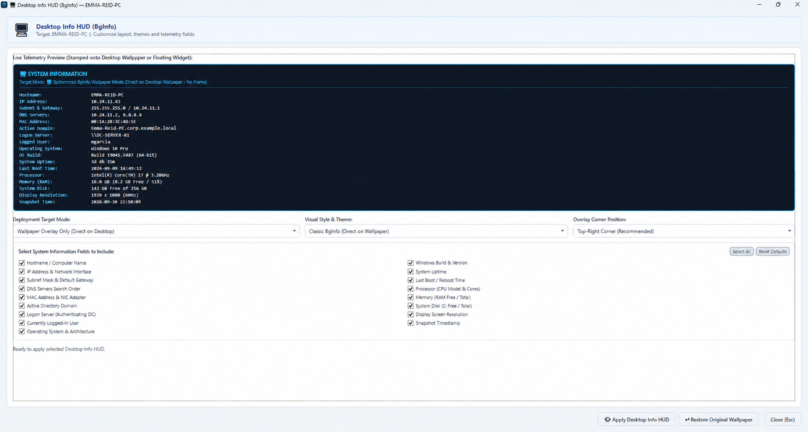
</p>

---

### 18. 👑 Windows God Mode & Enterprise Power Tweaks Hub
> **Master Control Panel Deployment & Enterprise OS Optimization Tweaks**  
> Deploy the Windows God Mode folder containing 200+ administrative applets to User or Public Desktops and context menus. Apply one-click power tweaks including "Take Ownership", Classic Windows 11 context menus, "Ultimate Performance" power scheme, and CompactOS storage compression.

<p align="center">
  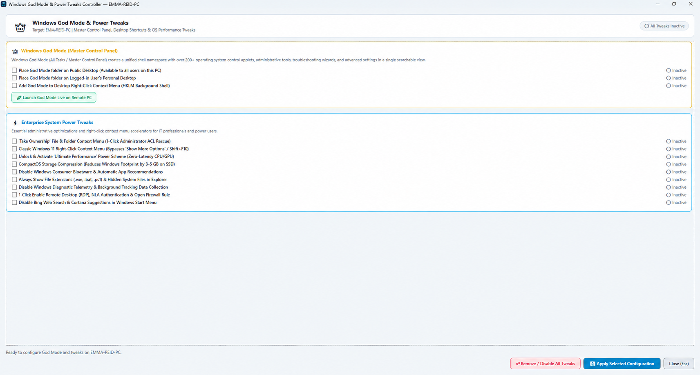
</p>

---

### 19. ⏱️ Remote System Restore Point Manager
> **On-Demand Checkpoint Creation & Remote System Rollback**  
> Remotely inspect System Restore protection status on client drives, enable or disable protection, create custom named checkpoints before updates, view historical restore points, and initiate remote rollbacks with automated reboot confirmation.

<p align="center">
  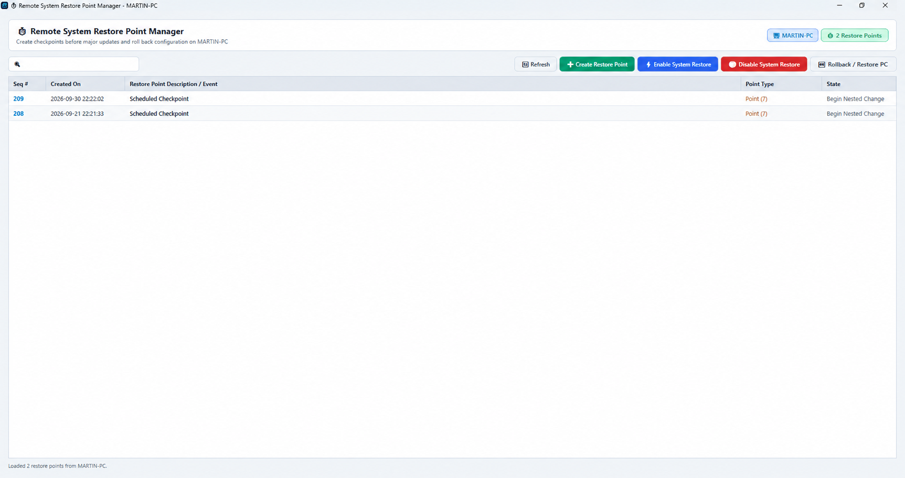
</p>

---

### 20. 💬 Remote User Messaging & Notification Hub
> **On-Screen Modal Dialogs & Action Center Toast Notifications**  
> Dispatch customized notification banners directly to remote user screens. Choose between intrusive modal popups requiring manual acknowledgement or modern Windows Action Center toast banners, complete with alert level badges, custom sender titles, and quick action templates.

<p align="center">
  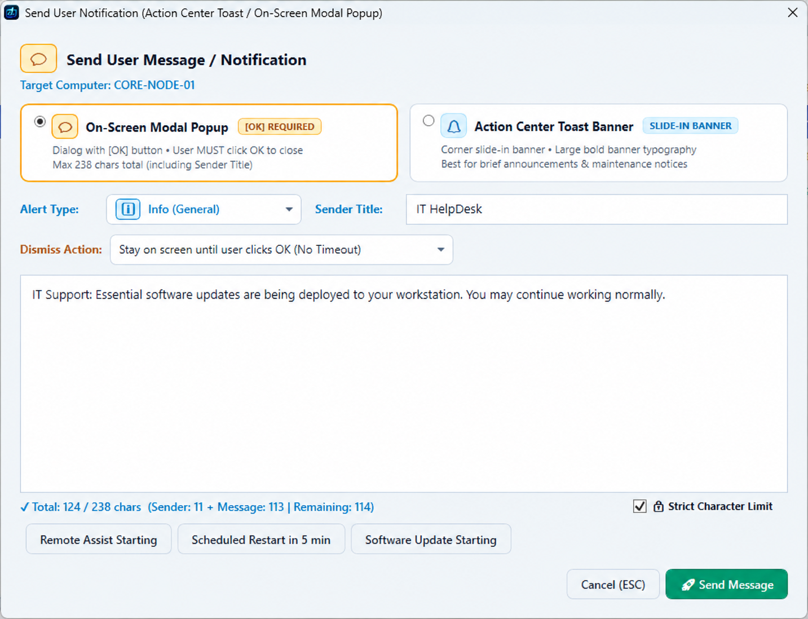
</p>

---

### 21. 🖨️ Remote Printers & Print Queue Manager
> **Fleet Printer Infrastructure, Ink/Toner Telemetry & Queue Management**  
> Manage local and shared domain network printers. Inspect multi-color ink and toner level indicators with intuitive color badges (Black, Cyan, Magenta, Yellow), view active spooler queues, purge stuck print jobs, and send remote test print pages.

<p align="center">
  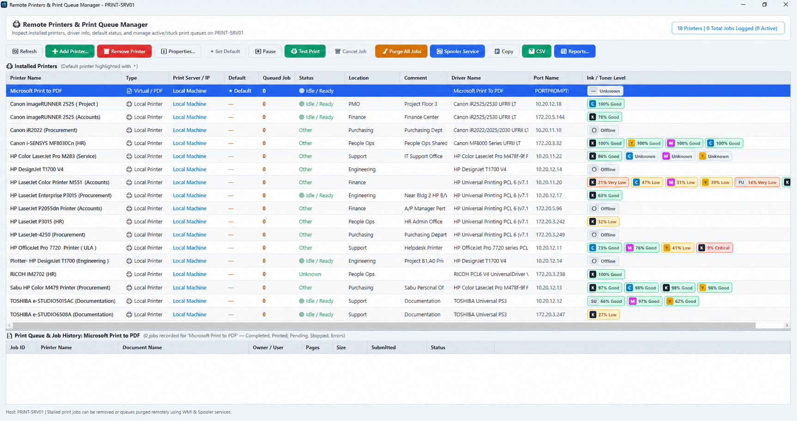
</p>

---

### 22. 📊 Print Fleet Audit Analytics — User Printing Summary
> **Executive User Paper Consumption Intelligence & Quota Auditing**  
> Comprehensive print intelligence ranking users by total print volume, individual job counts, average pages per job, maximum job size, data bandwidth, and departmental fleet utilization percentage.

<p align="center">
  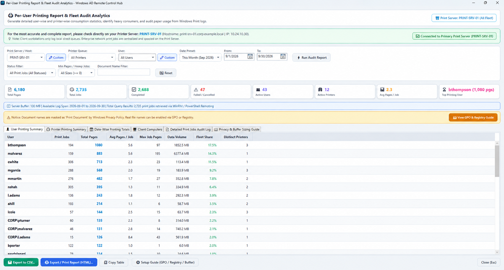
</p>

---

### 23. 🖨️ Print Fleet Audit Analytics — Printer Utilization Summary
> **Print Queue Workload Distribution & Fleet Capacity Planning**  
> Audit workload across all enterprise printers. Track total print jobs, page volumes, distinct users per device, data volume throughput, and overall fleet capacity share to identify over-utilized or idle printing hardware.

<p align="center">
  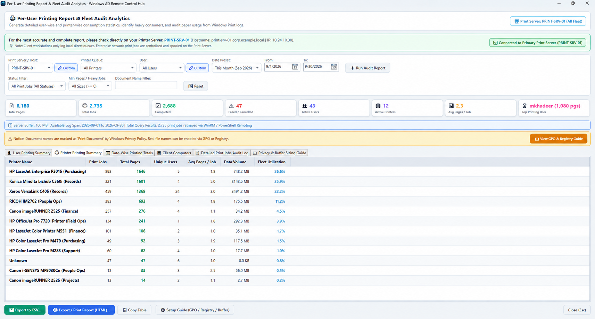
</p>

---

### 24. 📅 Print Fleet Audit Analytics — Date-Wise Printing Totals
> **Chronological Printing Trends & Daily Volume Analysis**  
> Track daily printing trends across selected calendar periods. Displays daily job counts, page totals, active daily users, active printers, and average pages per job to detect unusual peak usage days or unauthorized mass printing.

<p align="center">
  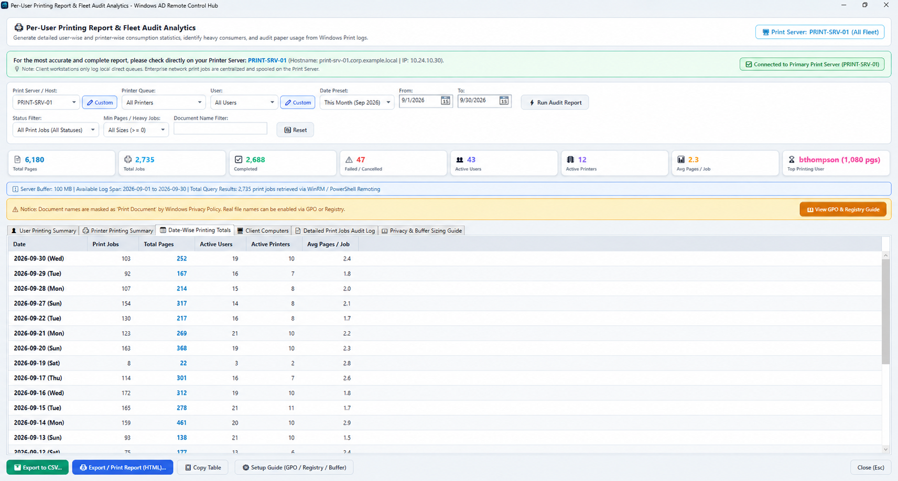
</p>

---

### 25. 💻 Print Fleet Audit Analytics — Client Workstations Breakdown
> **Endpoint Origin Auditing & Workstation Paper Tracking**  
> Trace every print job back to the originating client PC and primary authenticated user account. Identify which physical workstations generate the heaviest printer traffic across corporate departments.

<p align="center">
  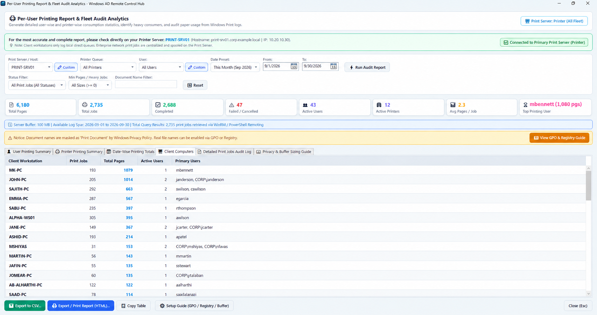
</p>

---

### 26. 📜 Print Fleet Audit Analytics — Detailed Print Jobs Audit Log
> **Transaction-Level Print Audit Ledger & Compliance Logging**  
> Complete audit log recording every print transaction with Job ID, exact date and time, user account, printer name, document/file name, page count, document file size in KB/MB, client workstation, network port IP, and final status (Completed / Printed / Cancelled). Supports 1-click HTML and CSV report export.

<p align="center">
  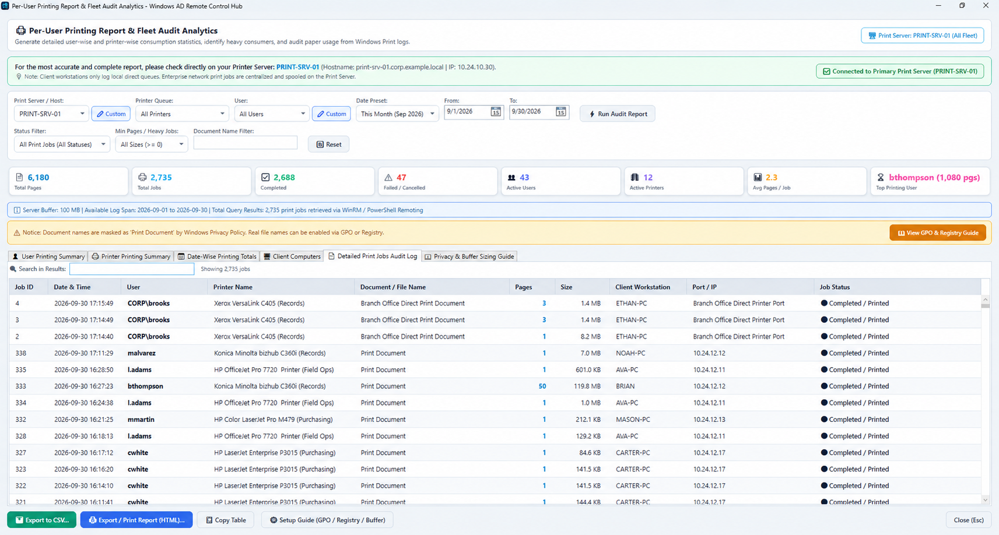
</p>

---

## 🛠️ Complete Feature Matrix

| Category | Features & Capabilities |
| :--- | :--- |
| **🚀 Remote Assistance** | • **Dedicated Quick Assist Button**<br>• Positioned after Shadow Session and before RDP in primary bottom action bar<br>• Authentic Microsoft Fluent Quick Assist icon embedded locally (100% offline-ready)<br>• Instant 1-click launch of `quickassist.exe` / `ms-quick-assist:` without needing `Ctrl+Win+Q` |
| **⏱️ Live Uptime & Durations** | • **Dedicated Live Uptime Column**: Displays real-time endpoint uptime (`⏱️ 3d 12h`, `⏱️ 18d 6h`, `⏱️ 1mo 5d`) with 1-click numerical sorting by total duration, health color thresholds (green for normal, amber for >30d overdue reboot), and exact last boot tooltip (`Last Boot: yyyy-MM-dd HH:mm`)<br>• **Smart Duration Decomposition**: Automatically scales idle and lock durations into clean, compact lowercase units (`m`, `h m` / `h`, `d h` / `d`, `mo d` / `mo`) eliminating confusing raw minute counts (e.g. `Idle (916m)` -> `Idle (15h 16m)`, `Locked (1020m)` -> `Locked (17h)`) |
| **⏱️ Idle & Presence** | • **Inactivity / Idle Monitor Agent in Top Quick Action Toolbar**<br>• Real-time workstation state detection: `🟢 Active`, `💤 Idle (...)`, `🔒 Locked (...)`, `🚪 Logged Off`, `🔴 Offline` with human-readable duration formatting (`m`, `h m`, `d h`, `mo d`)<br>• Continuous 24/7 lifecycle monitoring: Starts at Windows boot before user login, monitors Windows login screen, active sessions, user switching, logout, and shutdown<br>• Native Windows Service (`ADRC_IdleMonitor`) installed under `%SystemRoot%\System32\ADRemoteControl\ADRC_IdleAgent.exe` with runtime data in `%ProgramData%\ADRemoteControl\idle.json`<br>• Privacy-friendly: Monitors user idle time without keystroke logging or screen recording<br>• Smart mass parallel deployment and 1-click bulk uninstaller (`Remove Monitor`)<br>• Intelligent skip logic (skips installed hosts) & targeted retry for failed/unreachable hosts<br>• **Enterprise Tamper Protection**: Hidden from Programs & Features / Installed Apps, strict file permissions lockdown, eliminated from Task Manager Startup Apps, and native process tamper protection preventing standard user process termination in Task Manager<br>• Structured diagnostic logging (`[SUCCESS]`, `[SKIPPED]`, `[NO ACCESS]`, `[OFFLINE]`, `[FAILED]`, `[ERROR]`) |
| **🔄 Auto Refresh** | • **1-Minute Lightweight Silent Background Refresh Engine**<br>• Automatically executes every 60 seconds across all listed computers<br>• Atomic concurrency guard prevents overlapping/colliding scans<br>• Fast network connection checks on dedicated background threads<br>• Refreshes Online/Offline, Ping latency, Logged-in User, Active/Idle status, and Idle Agent presence silently without clearing the grid or interrupting user typing |
| **🎯 Smart Context Menu** | • **Dynamic Context Menu Architecture (Single vs Multi-Device)**<br>• Automatically detects multi-selection to show only bulk-compatible operations<br>• Protects against accidental single-host tool execution in bulk<br>• Full rich menu on single selection with clean "Not Configured / Not Supported" feedback on hardware or policy limitations (Battery, BitLocker, LAPS) |
| **🖥️ Remote Display** | • Remote Shadowing (Attended & Auto-Attended `/noConsentPrompt`)<br>• Full Control (Keyboard & Mouse) or View-Only<br>• Fullscreen & Multi-Monitor spanning<br>• Standard RDP & Server Console Admin (`/admin`) sessions |
| **🔔 User Alerts** | • Action Center Toast Notifications near the taskbar clock<br>• Audio chime notification<br>• Automated fallback to `msg.exe` |
| **📢 Broadcast Studio** | • **In-App Broadcast Studio & Notification Delivery Tracker**<br>• Centralized real-time broadcast dispatcher with domain and workstation targeting<br>• **Full Delivery Lifecycle Tracking**: `Sent / Pending` ➔ `Received` ➔ `Read` ➔ `Acknowledged`<br>• **Mandatory Acknowledgement Mode**: Requires users to click `✓ Acknowledge` before closing critical notices<br>• **Fleet Reach Analytics & Receipts Ledger**: Real-time delivery progress bars and detailed per-workstation compliance receipts (Computer, User, Domain, Delivery Timestamp, Status)<br>• **Contextual Lifecycle Action Control**: Deactivation dynamically limited to active broadcasts; automatically marks `✓ Completed` upon fleet reception |
| **👑 God Mode & Tweaks**| • **Windows God Mode (Master Control Panel) Remote Controller (Single & Bulk)**<br>• Deploy/remove God Mode folder shortcut on User & Public Desktop<br>• Native desktop background right-click context menu integration<br>• 1-Click live interactive launch of God Mode Master Control Panel on remote user's screen<br>• **"Take Ownership"** context menu injector to reclaim permissions on locked folders<br>• **Classic Windows 11 Context Menu** restorer (bypasses "Show more options")<br>• **"Ultimate Performance"** power plan activator for maximum hardware throughput<br>• **CompactOS** storage compression (free 3-5 GB on SSD)<br>• **Disable Consumer Bloatware** & promotional tiles<br>• **Always Show File Extensions & Hidden Files** in Explorer<br>• **Disable Windows Diagnostic Telemetry** for enterprise privacy and compliance<br>• **1-Click Enable Remote Desktop (RDP)**, NLA & Firewall<br>• **Disable Bing Web Search** in Start Menu |
| **🖼️ Wallpaper Changer**| • **Remote Desktop Wallpaper Changer & Manager (Single & Bulk)**<br>• Remotely apply custom corporate wallpaper (JPG, PNG, BMP) to single or multi-selected computers<br>• Fit styles: Fill (Default), Fit, Stretch, Tile, Center, Span<br>• Embedded in-app image preview before applying<br>• Automatic backup of original wallpaper prior to replacement<br>• 1-Click restore original wallpaper on single or bulk target computers<br>• Seamless updates across active console and RDP user sessions |
| **🖥️ Desktop Info HUD** | • **Sysinternals BgInfo Wallpaper Engine (`🖥️ HUD (BgInfo)`)**<br>• Direct-to-wallpaper stamping matching classic Sysinternals BgInfo<br>• Two-column telemetry with drop shadows for 100% legibility on any wallpaper<br>• 3 deployment modes: Wallpaper Overlay, Floating HUD Widget, or Both<br>• Dynamic profile path discovery<br>• Theme-accurate live preview and 1-click wallpaper restoration |
| **🌐 Browser & App Run** | • **Remote Browser URL & Program Launcher**<br>• Launch URLs in Default Browser, Microsoft Edge, or Google Chrome<br>• Non-interactive execution directly inside user session |
| **🚀 Startup Apps** | • **Remote Startup Applications & Autoruns Manager (`🚀 Startup`)**<br>• Machine and per-user profile startup enumeration<br>• Dynamic **Enable / Disable** toggling without registry deletion<br>• Preserves user configurations<br>• 1-Click delete orphaned autorun entries and CSV export |
| **👥 Local Users** | • **Local Computer Users & Security Manager (`👥 Local Users`)**<br>• Works without active logon session (direct local accounts connection)<br>• Account type badging: 👑 Administrator, 👤 Standard User, 🚼 Guest<br>• Remote user creation, password reset, and enable/disable toggle<br>• **Secure User Deletion**: Multi-factor administrative password verification and confirmation keywords<br>• **System Account Shield**: Protects essential system and active login accounts from accidental removal |
| **⏱️ System Restore** | • **Remote System Restore Point Manager (`⏱️ System Restore`)**<br>• Remotely check System Restore protection status on system drives<br>• Enable or disable protection remotely<br>• Create on-demand named checkpoints prior to software or configuration updates<br>• View chronological restore point history with sequence numbers and timestamps<br>• Remote system rollback to selected restore points with automatic reboot confirmation |
| **📈 Live Monitor** | • **Sub-Second Live Performance Monitor (`📈 Live Perf`)**<br>• high-frequency CPU, RAM, Network (RX/TX), Disk active I/O<br>• 60-second historical sparkline graphs & performance charts<br>• Motherboard DIMM module slot inspector (DDR4/DDR5, MHz, part numbers)<br>• Physical storage drives, link speeds, and network adapter telemetry |
| **🌐 Network & IP Hub** | • **Remote Network & IP Configuration Hub (`🌐 IP Config`)**<br>• Remote DHCP ⇄ Static IPv4 switching with format validation<br>• Remote `ipconfig /flushdns`, `/registerdns`, `/release`, `/renew`<br>• Safe network adapter reset script with automatic re-enable |
| **🔒 Lock & Unlock** | • **Workstation Lock & Unlock Controller (`🔒 Lock Screen`)**<br>• Real-time lock screen state detection and session telemetry<br>• Remote workstation lock, console session reconnect, and direct session unlock<br>• Embedded live diagnostic execution console |
| **🗄️ Network Drives** | • **Remote Mapped Network Drives Manager (`Ctrl + D`)**<br>• Dual-engine inspection across registry and active mounted network disks<br>• Real-time storage capacity gauge (Free / Total GB)<br>• 1-Click **Add Drive Mapping** with automatic free letter selection (Z-D) & UNC test<br>• **Edit Mapping** and modify persistence (Reconnect at sign-in)<br>• **Disconnect & Remove** mapping from registry and active session<br>• 1-Click Explorer launcher into remote UNC share |
| **💻 Remote Terminal** | • Interactive command console (CMD & PowerShell)<br>• 1-click presets: `whoami`, `gpupdate /force`, `ipconfig /all`, `sfc /scannow`, `ping`<br>• Output logging and clipboard export |
| **💻 Diagnostics** | • Visual sensor dashboard with CPU, RAM, and Disk storage gauges<br>• Motherboard, BIOS, Serial Number / Dell Service Tag inspection<br>• System boot timestamp and continuous uptime health tracker |
| **📊 Processes & Services**| • Remote Task Manager: view processes, memory usage, terminate hung apps<br>• Windows Services Controller: query status, Start, Stop, Restart services<br>• 1-Click Remote Print Spooler restart |
| **📋 Event Log Viewer** | • High-speed reverse-chronological streaming of remote event logs<br>• **Authoritative Deep Entity Search**: Query across all event records within selected date ranges for User, Source Host, IP Address, File Path/Name, and Message Text up to your display limit<br>• **Precision Custom Date & Time Range Picker**: Targeted forensic auditing with From/To Date and Time inputs and instant boundary termination<br>• **Strict Company-Internal Privacy**: File share and user file activity auditing remains 100% local on the administrator workstation<br>• **Categorized Quick Presets Dropdown**: 35+ enterprise forensic and diagnostic presets (Group Policy & GPUpdate diagnostics, Windows LAPS, user account creation/deletion/lockout/modification, group memberships, file share access/deletion/edits, logon failures, threats, system reliability)<br>• **Instant Type-to-Find Preset Search**: Type any keyword with continuous keyboard input to filter presets live<br>• **Forensic Entity Filtering & Sortable Columns**: Dedicated filter toolbar with exact-match search, live auto-suggestions, and target counters<br>• **Native Remote Server-Side Filtering Engine**: Filters directly on the remote host for lightning-fast query results<br>• **Full Multi-Channel Support**: System, Application, Security, Group Policy (Operational), Windows LAPS, Setup, RDP Session Manager, Print Spooler, Task Scheduler, Windows Defender, DNS Client, Directory Service, DNS Server<br>• **Vivid Severity Badges**: Audit Success (Emerald), Audit Failure (Rose), Critical, Error, Warning, Information, Verbose<br>• **Expanded Query Limits**: 50 up to 10,000 events<br>• 1-Click rapid action pills (including `📜 GPUpdate`), multi-token search, and full CSV export |
| **🖨️ Printer Management & Fleet Audit**| • Inspect local printers and domain print server shared printers<br>• Accurate active user default printer detection (`⭐ Default`) via remote registry<br>• Real-time Test Print (`🖨️ Test Print`) execution<br>• Live **Pending Jobs** column cross-referenced with active queue<br>• Real-time queue inspection: Document, Owner, Pages, Size, Submission Time<br>• 1-Click `Cancel Job`, `Purge All Jobs`, and `Restart Spooler`<br>• **Per-User Printing Reports & Fleet Job Statistics**: Audit print server logs across custom date ranges (Today, This Month, This Year, All History) with automated Print Server guidance banner and 1-click redirection, real-time dynamic dropdown filtering across users and printer queues, User Summary, Printer Utilization, Date-Wise Trends, Workstation breakdowns, Bulk Page filters, Document Masking privacy setup, and printable Executive HTML/CSV reports |
| **📁 File Explorer** | • 1-Click Explorer access into `\\<host>\C$`<br>• Direct navigation to remote user's `Desktop`, `Downloads`, and `Documents` |
| **👤 AD Account Actions**| • **Enterprise 360° AD User Profile Inspector & In-App Editor**: 40+ directory attributes, organizational hierarchy, contact information, and security group memberships<br>• **✏️ Edit AD User Profile Attributes**: In-place editing of First/Last/Display Name, Title, Department, Company, Office, Phone, Mobile, Email, and Address with direct LDAP commit<br>• **🏷️ Rename Remote Computer**: Rename remote computer over encrypted administrative channels with automated restart option and pre-flight privileges diagnostics<br>• **📝 Edit / Set Computer Description**: Live Active Directory computer description updater synchronized to the computer grid<br>• Real-time lockout detection: button turns red (`⚠️ Account Locked`)<br>• 1-click AD account unlocking<br>• Remote password reset with optional forced password change at next logon |
| **🧹 Deep Temp Cleaner** | • Purges 4 administrative paths: `C:\Windows\Temp`, User `AppData\Local\Temp`, `Recent` files across all profiles, and `Prefetch`<br>• Reports exact file count and MB disk space freed |
| **⚡ Power Management** | • Wake-on-LAN (WOL) magic packets<br>• Lock remote screen without logging off<br>• Graceful remote user session logoff<br>• Remote reboot and shutdown with 5-second countdown |
| **📜 Audit Logging** | • Reverse-chronological activity log (newest records always on top)<br>• Isolated single-machine audit filtering<br>• Outcome logging: `SUCCESS`, `FAILED`, `CANCELLED` with error messages<br>• Dedicated administrative isolation preventing background cloud telemetry from polluting local endpoint action records |
| **🔄 Auto-Updater** | • Direct GitHub Releases API integration with `SuperUser-exe/Windows-Active-Directory-Remote-Administration-Control-Center`<br>• In-app release notes viewer<br>• In-place download, detached update script, and automatic restart (0 browser redirect!) |

---

## 🖥️ Complete UI Element, Toolbar, Column & Control Reference

### 1. 🔍 Header Navigation & Global Controls
* **Quick Filter / Search Box (`Ctrl+S` / `Ctrl+F`)**: Real-time filter box that narrows the inventory list instantly as you type. Searches across Computer Names, IP Addresses, Logged-in Users, Descriptions, Operating Systems, and OUs. Pressing `ESC` clears the filter.
* **`🔄 Refresh AD / Scan` (`F5` / `Ctrl+R`)**: Re-synchronizes computer inventory from Active Directory Domain Services and triggers a 24-thread parallel network status and ping latency check.
* **`🚀 Updates`**: In-app GitHub Release monitor. Compares current version with the latest release, displays formatted changelogs, and performs a 1-click in-place update and restart in ~1.5 seconds without opening a browser.
* **`ℹ️ Usage Guide`**: In-app operator reference manual with searchable tabs, copy, and export features.
* **`📜 Activity Log`**: Reverse-chronological audit trail of all administrative actions. Records timestamp, operator, target host, action, and detailed outcome status (`SUCCESS`, `FAILED`, `CANCELLED`), strictly isolated from background fleet telemetry and connection retries.
* **`🌙 Theme Toggle`**: Instantly switches between high-contrast Dark Mode and Light Mode with zero visual glitching.
* **`💬 Feedback`**: In-app star rating and suggestion submission dialog allowing operators to submit 1 to 5 star ratings, bug reports, or feature suggestions with instant transmission.
* **`💬 Community / Telegram`**: Direct link to the official Telegram community chat (`t.me/WADRACC`) for support and feedback.

### 2. ⚡ Top Quick Action Toolbar & Multi-Select Operations
Located directly above the computer inventory grid, the **Quick Action** toolbar provides rapid 1-click access to primary monitoring and broadcast actions across multi-selected computers (with all additional bulk power, wallpaper, and administrative actions seamlessly accessible via the multi-select right-click context menu):
* **`⏱️ Inactivity Monitor` / `Install Monitor` / `Retry Monitor` / `Remove Monitor`**: 
  - **1-Click Mass Service Deployment**: Installs the monitoring agent as a system-level Windows Service (`ADRC_IdleMonitor`) with automatic boot-time startup (`start= auto`).
  - **Continuous 24/7 Presence Monitoring**: Starts with Windows during system boot before any user logs in; tracks presence across login screens, active user sessions, lock/unlock, user switching, and system shutdown.
  - **Intelligent Skip**: Inspects target endpoints and automatically skips computers where the service is already installed and healthy.
  - **Targeted Retry**: Automatically re-targets only failed, offline, or inaccessible machines on subsequent clicks.
  - **Dynamic Toggle to Uninstaller**: When 100% of endpoints are monitored, button dynamically transitions to `Remove Monitor` for 1-click bulk cleanup with multi-stage service, task, process, and file teardown.
  - **Granular Diagnostic Logging**: Every machine logs an itemized status code (`[SUCCESS]`, `[SKIPPED]`, `[NO ACCESS]`, `[OFFLINE]`, `[FAILED]`, `[ERROR]`).
* **`💬 Message`**: Multi-endpoint notification broadcaster supporting Modal Popups and Toast Banners.
* **`⚡ Power & WOL (Context Menu)`**: Mass-dispatch Wake-on-LAN packets, remote screen lock, user logoff, reboot, or shutdown.
* **`🖼️ Wallpaper (Context Menu)`**: Mass-deploy custom corporate desktop wallpapers (Fill, Fit, Stretch, Tile, Center, Span) with embedded image preview and 1-click backup restoration.
* **`👑 God Mode (Context Menu)`**: Mass-deploy or remove the Windows God Mode shortcut on user and public desktops, and toggle 10+ enterprise system power tweaks.
* **`🖥️ HUD (BgInfo) (Context Menu)`**: Mass-stamp system telemetry onto desktop wallpapers in Sysinternals BgInfo style, or deploy floating companion widgets.
* **`🧹 Deep Clean (Context Menu)`**: Concurrently purges Temp, User Temp across all profiles, Recent, and Prefetch on all target endpoints.
* **`🔄 GPUpdate (Context Menu)`**: Executes background `gpupdate /force` in parallel across targets.
* **`📦 Deployer (Context Menu)`**: Silent MSI and EXE software deployment wizard across selected endpoints.
* **`📁 Push File (Context Menu)`**: Multi-threaded administrative file and script distribution utility pushing files into `C$\Temp`.

### 3. 📊 Computer Inventory Grid Columns
* **`Live Status`**: Real-time reachability (`🟢 Online (Xms)`, `🔴 Offline`, `🟡 Checking...`, `🔵 WinRM Only`).
* **`Workstation State`**: Real-time presence telemetry (`🟢 Active`, `💤 Idle (1h 30m)`, `🔒 Locked (17h)`, `🚪 Logged Off`, `🔴 Offline`) with human-readable duration scaling.
* **`Computer Name`**: NetBIOS / DNS hostname with 1-click sorting.
* **`IPv4 Address`**: Active network adapter IP address.
* **`Logged-in User`**: Currently authenticated domain user (`DOMAIN\User`).
* **`Logon Time`**: Interactive session logon timestamp.
* **`Uptime`**: Real-time system uptime (`⏱️ 3d 12h`, `⏱️ 18d 6h`, `⏱️ 1mo 5d`) with 1-click numerical duration sorting, color health thresholds, and last boot tooltip.
* **`Operating System`**: OS edition and build (Windows 10, 11, Server 2019/2022).
* **`Description`**: Active Directory computer description attribute.
* **`OU (Computer / User)`**: Dual organizational unit placement for device and logged-in user.

### 4. ⚡ Bottom Connection Bar (Quick Control)
Positioned directly beneath the DataGrid for rapid keyboard-first dispatching:
* **Session Configuration Checkboxes**:
  - **`🔔 Alert User`**: Sends an on-screen notification to the remote user before shadowing (default: enabled).
  - **`✋ Ask User Permission`**: Prompts the remote user with an Accept/Reject dialog before connecting (default: enabled).
  - **`Full Control`**: Interacts with remote keyboard and mouse (default: enabled).
  - **`Full Screen`**: Launches connection in full screen mode.
  - **`Multi-Monitor`**: Spans across multi-monitor display setups (`/multimon`).
  - **`Admin Console`**: Connects directly to the physical server console session (`/admin`), bypassing RDS CAL limitations.
* **Primary Connection Buttons**:
  - **`⚡ Connect Shadow Session` (`Enter`)**: Hooks directly into RDS screen shadowing (`mstsc.exe /shadow:<id> /control`) for zero-lag mirroring without kicking the user off.
  - **`🚀 Quick Assist`**: Dedicated 1-click launcher for Microsoft Quick Assist featuring the official Microsoft Fluent Quick Assist icon embedded locally for 100% offline reliability.
  - **`🖥️ Connect RDP Session` (`Ctrl+Enter`)**: Launches standard Remote Desktop Protocol connection (`mstsc.exe /v:<Host>`) with automated pre-flight port 3389 reachability verification. Includes a split-button dropdown menu (`▼`) providing instant access to the **Remote Desktop Configuration & Diagnostic Center**, port 3389 reachability probing, Network Level Authentication (NLA) inspection, and one-click remote firewall rule activation.

### 5. 🛠️ Administrative Category Toolbars
* **Line 1 (`🛠️ Tools`)**:
  - **`💻 Console` (`Ctrl+T`)**: Remote command terminal (CMD/PowerShell) with 1-click presets (`whoami`, `gpupdate`, `sfc`, `ipconfig`, `ping`).
  - **`📈 Live Perf` (`Ctrl+Shift+M` / `Ctrl+I`)**: High-resilience live performance & hardware monitor tracking real-time CPU, RAM, Network throughput, and Disk I/O with historical sparklines, full-screen deep monitoring view with timeline analysis and adaptive light/dark metric tiles, DIMM memory architecture, logical disk volumes with capacity progress bars, BIOS identity & serial numbers, running processes, Windows services, and instant fail-safe fallbacks.
  - **`📊 Task Mgr`**: Remote process controller displaying PID, Memory, and CPU time with instant search and `🛑 End Process`.
  - **`⚙️ Services`**: Windows services manager with Start, Stop, Restart, Start Mode toggling, and 1-click Print Spooler restart.
  - **`📦 Software`**: Dual-engine software inventory with 1-click silent uninstallation for MSI and EXE packages.
  - **`🚀 Startup`**: Remote startup applications manager. Toggle programs Enabled/Disabled without deleting registry keys.
  - **`📋 Events`**: Windows Event Log viewer with reverse-chronological streaming, categorized 35+ preset dropdown with vivid badges, live type-to-find search, Authoritative Deep Entity Search across full date ranges (User, Client / Source PC, IP, and File operations with exact-match search, live suggestions, and Search button / Enter execution), precision Custom Date & Time Range picker (From/To Date and Time), strict company-internal file share auditing privacy, dedicated sortable columns, full multi-channel auditing across 14 channels (including Group Policy Operational, Security, LAPS, System, App), vivid severity badges (including Audit Success & Failure), 1-click `📜 GPUpdate` diagnostic pill, and expanded limits up to 10,000 events.
  - **`🖨️ Printers`**: Local and network printer manager. Add UNC shared printers, remove, inspect properties, pause/resume, set default, test print, purge queues, and launch **Per-User Printing Reports & Fleet Statistics** (`📈 Reports...`).
  - **`🌐 IP Config`**: Remote network hub. Switch DHCP ⇄ Static IP, One-Click Network Repair & Reset suite (autonomous sequential DNS, ARP, Winsock, TCP/IP stack, adapter reset, and DHCP release/renew), flush DNS, register DNS, release/renew leases, and reset network adapters safely.
  - **`💬 Message` (`Ctrl+M`)**: Remote user messaging dialog with exact character limits, Title/Subtitle/XL modes, Large Text toggle, and alert type badges.
* **Line 2 (`📁 Folders & 👤 Users`)**:
  - **`💾 Open C$/`**: Opens `\\<Host>\C$` in Windows Explorer.
  - **`🖥️ Desktop`**: Opens remote user's Desktop folder in Explorer.
  - **`📥 Downloads`**: Opens remote user's Downloads folder in Explorer.
  - **`📄 Documents`**: Opens remote user's Documents folder in Explorer.
  - **`🗄️ Net Drives` (`Ctrl+D`)**: Remote mapped network drives manager (dual-engine inspection, add mapping with free letter auto-selection, edit, disconnect, test UNC, local open).
  - **`👤 Profile Card` (`Ctrl+Shift+U`)**: Enterprise 360° AD User Profile Inspector (40+ directory attributes, organizational hierarchy, contact info, security metrics, and interactive Group Membership Manager with Add/Remove group actions).
  - **`👥 Local Users`**: Local computer SAM accounts manager (provision users, reset passwords, enable/disable accounts, and secure user deletion with administrator password confirmation and critical system account safeguards).
  - **`🔓 Unlock User` (`Ctrl+U`)**: Dynamic Active Directory account unlocker. Button turns red (`⚠️ Account Locked`) when account is locked.
  - **`🔑 Reset Pass` (`Ctrl+Shift+P`)**: Remote password reset dialog with option to force password change at next logon.

### 6. 🎯 Dynamic Smart Context Menu & Fast Action Search (Single vs Bulk Selection)
* **Integrated Fast Action Search Bar**: Right-clicking automatically focuses the embedded search bar. Typing any keyword (such as `ping`, `event`, `temp`, `reboot`, `rdp`, `uac`, `service`, `wallpaper`, `restore`) instantly filters all 50+ tools in real-time, displaying a flat results list with category badges. Press `Enter` to launch the top tool immediately, `Down Arrow` to navigate, or `Escape` to clear.
* **Target Computer Header Banner**: Prominently certifies targeted hostname, IP address, and online status at the top of the menu.
* **Single-Computer Selection Menu**: Direct top-level access to Screen Shadowing, Fix UAC, RDP, and Remote Console, alongside 7 streamlined, deduplicated submenus:
  - `⚙️ System Administration & Management ▸`: Task Manager, Services, Installed Software Uninstaller, Startup Apps, Printers & Queues, Local Users & Groups, Computer Management MMC, Task Scheduler MMC, Windows Server Task Manager Disk Counters, Rename Host, AD Description.
  - `🌐 Active Directory & DNS Server Troubleshooting ▸`: Dedicated identity & DNS tools (Restart DNS Service, Restart DNS Cache, Clear Resolver Cache, Resolve Custom Name, Ping 8.8.8.8) exclusively shown on Domain Controllers and DNS servers.
  - `📊 Diagnostics & Health ▸`: System Specs, Live Performance Monitor (with full-window deep historical view), Remote System Restore Manager, Remote Event Logs, Battery Health, WMI Repair, Computer Activity Log.
  - `🛠️ Customization, Automation & Deployment ▸`: Remote System Restore Manager (create checkpoints, enable/disable, rollback), Background Wallpaper Deployer, Remote Screen Saver Configuration, Windows God Mode, File Push, Software Deployer.
  - `🌐 Network & Connectivity ▸`: Ping Host & Info, Network & IP Config (DHCP / Static), DNS Resolution & nslookup, Flush Remote DNS, Enable ICMP Firewall Rule, Open URL in User's Browser, Wake-on-LAN.
  - `👤 Active Directory & User Session ▸`: View AD Profile Card, Edit Attributes, Unlock Account, Reset Password, Password Expiry Checker, Send User Toast Message, Logoff Active Session.
  - `📁 Files & Shared Folders ▸`: Open C$ Admin Share, Desktop Folder, Downloads Folder, Documents Folder, Mapped Network Drives Manager, Push File/Script to Remote PC.
  - `🛠️ Customization, Automation & Deploy ▸`: Silent Software Deployer, Force Remote GPUpdate, Windows God Mode & Power Tweaks, Desktop Info HUD (BgInfo), Change Desktop Wallpaper, Remote Screen Saver Configuration, Inactivity & Idle Agent (Deploy / Status / Uninstall).
  - `⚡ Security & Power Control ▸`: BitLocker Recovery Keys, Windows LAPS Management Suite (Native Decryption, Plaintext Viewing, 1-Click Rotation & Calendar Expiration Scheduling), 4-Path Deep Temp Clean, Remote Lock & Unlock Controller, Instant Screen Lock, Reboot Computer, Shutdown Computer, Scheduled Power Actions (Date/Time picker).
* **Multi-Computer Bulk Selection Menu**: Right-clicking multiple selected computers automatically presents the bulk fast search bar and organized bulk operations for fleet maintenance.

---

## 📁 Repository & Release Structure

```text
Windows_AD_Remote_Administration_Control_Center/
├── Windows AD-Admin Control Center v2.7.0.exe  # Standalone portable Windows executable (~2000 KB)
├── Run_AD_Remote_Control.bat           # 1-Click launcher script (auto-launches versioned exe)
├── README.md                          # Complete project documentation & quick start
├── VERSION.txt                        # Release version metadata
├── CHECKSUMS.txt                      # Official SHA-256 integrity checksums
├── Documentation/                     # Complete administrative documentation suite
│   ├── USAGE_GUIDE.md                 # In-depth operator reference manual & GPO guide
│   ├── USAGE_GUIDE.txt                # Plain text version for in-app fallback viewer
│   ├── CHANGELOG.md                   # Detailed version release notes & history
│   └── LICENSE                        # MIT License
├── Tools/                             # Auxiliary administrative tools
│   └── ADRC_IdleAgent.exe             # Endpoint inactivity and presence monitoring agent
├── PS Scripts/                        # Domain & endpoint configuration scripts
│   └── Configure_Endpoint_GPO.ps1     # Automated endpoint GPO & firewall configuration script
└── Images/                            # Screenshots and visual assets
    ├── Screenshots/                   # Full-resolution feature screenshot suite (26 screens)
    ├── Dashbaord.png                  # Legacy dashboard overview preview
    └── app.ico                        # High-resolution application icon
```

---

## 🚀 How to Run

### Option 1: Standalone Portable Executable
Download the latest `Windows AD-Admin Control Center v2.7.0.exe` from [GitHub Releases](https://github.com/SuperUser-exe/Windows-Active-Directory-Remote-Administration-Control-Center/releases).  
Right-click `Windows AD-Admin Control Center v2.7.0.exe` and select **Run as Administrator** (using Domain Admin credentials):
```cmd
"Windows AD-Admin Control Center v2.7.0.exe"
```

### Option 2: 1-Click Convenience Launcher
Alternatively, run the included launcher script:
```cmd
Run_AD_Remote_Control.bat
```

### Option 3: Reset Local PC Inspect & Usage Analytics Data
To reset workstation telemetry metrics, cumulative application opens, and most-used feature statistics back to a clean baseline:
```cmd
the usage metrics reset utility.bat
```
*(Or run `powershell -ExecutionPolicy Bypass -File .\the usage metrics reset utility.ps1`)*

---

## ⚙️ Group Policy & Administrator Setup Requirements

### 1. Administrator Account Permissions & Authorization Policy

> [!IMPORTANT]
> **Strict Domain / Enterprise Administrative Authorization Enforcement**:  
> To safeguard domain environments and prevent unauthorized workstation management, the application verifies the security identity of the launching user at startup. The application will **ONLY** launch if the user belongs to at least one of the following Domain / Enterprise administrative accounts:
> - **Domain Admins** (Well-Known SID ending in `-512`)
> - **Enterprise Admins** (Well-Known SID ending in `-519`)
> - **Schema Admins** (Well-Known SID ending in `-518`)
> - **Account Operators** (Well-Known SID ending in `-548`)
> - **Server Operators** (Well-Known SID ending in `-549`)
> - **Authorized Active Directory Administrative Groups** (e.g., `IT-Admins`, `IT Admins`, `IT Administrators`, `Server Admins`, `System Admins`, `Security Admins`, `Network Admins`, `Cloud Admins`).
>
> ⚠️ **Local Administrators are strictly disallowed on Domain-Joined Machines**: Users who are only granted local workstation administrative privileges (`BUILTIN\Administrators` / `Local Administrators`) are blocked from executing this suite to maintain enterprise governance.
>
> 💡 **Need custom groups added or removed?** If your organization uses specialized administrative group names or specific role requirements, please [request a feature or open an issue on GitHub](https://github.com/SuperUser-exe/Windows-Active-Directory-Remote-Administration-Control-Center/issues) or reach out via [Telegram](https://t.me/WADRACC), and the author will gladly make the changes for your environment!

- **Domain Admins**: Fully privileged across all domain endpoints, Active Directory user objects, and admin shares out of the box.
- **Delegated Helpdesk Technicians**: Ensure support staff are members of an authorized domain administrative group (e.g. `Domain Admins` or `IT-Admins`) with delegated Active Directory permissions on target user OUs in `dsa.msc` for password resets and account unlocking.

### 2. Enable Remote Shadowing (Auto-Attended & Attended)
To enable shadowing without disconnecting active users:
1. Open `gpmc.msc` on your Domain Controller and edit your Workstations Policy.
2. Navigate to:  
   `Computer Configuration -> Policies -> Administrative Templates -> Windows Components -> Remote Desktop Services -> Remote Desktop Session Host -> Connections`
3. Configure:
   - **Set rules for remote control of Remote Desktop Services user sessions**:
     - Set to **Enabled**.
     - Choose **Full Control without user's permission** (for instant unattended screen mirror) or **Full Control with user's permission** (prompts user to allow/deny).
   - **Allow users to connect remotely by using Remote Desktop Services**:
     - Set to **Enabled**.
4. Run `gpupdate /force` on client workstations.

### 3. Windows Defender Firewall Rules (Domain Profile)
Ensure the following ports and predefined rule groups are enabled via GPO:
- **TCP 3389**: Remote Desktop & Remote Shadowing
- **TCP 445 & 139**: SMB File Sharing (`C$` access, remote folder navigation, deep temp clean)
- **TCP 135 & Dynamic RPC**: WMI Management (Hardware Specs, Task Manager, Services, Remote Console, Drive Mapping)
- **TCP 5985**: WinRM HTTP (for Action Center Toast notifications)
- **ICMPv4**: Ping echo request for live online/offline latency detection
- **Remote Registry Service**: Startup type set to **Automatic** for instant cross-profile software and drive mapping scans.

---

## 🔄 Seamless In-App Auto-Updating

When you publish a new version on GitHub Releases:
1. Users click **`🚀 Updates`** in the application header (or the app notifies them automatically).
2. The changelog and release notes appear inside the app.
3. Clicking **`⚡ Update & Restart Now`** downloads the new `.exe` and updates the app in-place in ~1.5 seconds.
4. **No browser redirection, no manual file copying, no installers!**

---

## ⌨️ Universal Shortcuts

| Shortcut | Action |
| :--- | :--- |
| **`Ctrl + S` / `Ctrl + F`** | Focus Quick Search box and select all text |
| **`F5` / `Ctrl + R`** | Refresh computer inventory from Active Directory |
| **`Enter`** | Connect Shadow Session (screen mirror) to selected computer |
| **`Ctrl + Enter`** | Connect Remote Desktop (RDP) login |
| **`Ctrl + Win + Q`** | Launch Microsoft Quick Assist (or click the dedicated **Quick Assist** button) |
| **`Ctrl + P`** | Ping selected computer and display latency |
| **`Ctrl + T`** | Open interactive in-app Remote Console (CMD / PowerShell) |
| **`Ctrl + I`** | Open System Hardware Diagnostics & Specs |
| **`Ctrl + D`** | Open Remote Mapped Network Drives Manager (Add / Edit / Remove) |
| **`Ctrl + M`** | Open Send User Notification Message dialog |
| **`Ctrl + U`** | Unlock logged-in user account in Active Directory |
| **`Ctrl + Shift + P`** | Reset domain user password |
| **`Ctrl + Shift + U`** | Open 360° Active Directory User Profile Inspector |
| **`ESC`** | Clear search text (when focused), or close any open popup modal |

---

## 🌟 How to Showcase, Support & Community Discussions

If this application saves you and your IT team hours of tedious administrative work:
- ⭐ **Star the Repository**: Drop a star on [GitHub](https://github.com/SuperUser-exe/Windows-Active-Directory-Remote-Administration-Control-Center) to help other sysadmins discover this free tool!
- 💬 **Join the Discussion**: Share workflow feedback, request custom administrative group authorizations, or submit feature requests on [GitHub Discussions](https://github.com/SuperUser-exe/Windows-Active-Directory-Remote-Administration-Control-Center/discussions) and [Telegram](https://t.me/WADRACC).
- 📢 **Share with Fellow Sysadmins**: Mention it on Reddit (`r/sysadmin`, `r/PowerShell`), LinkedIn, or your internal IT engineering channels.

---

## 📄 License, Legal & Ethical Use Notice

Developed with ❤️ by **[Askarali Mattummal]** | [GitHub](https://github.com/SuperUser-exe) | [Telegram Community](https://t.me/WADRACC)).  
Licensed under the [MIT License & Distribution Terms](LICENSE).

> [!CAUTION]
> **Authorized IT Administrative Use Only**: This software is designed, developed, and published strictly for authorized IT systems administrators and certified support personnel to maintain, monitor, and troubleshoot authorized enterprise domain infrastructure. Any unauthorized deployment, surveillance, privacy violation, or malicious use is strictly prohibited. The author assumes no responsibility or liability for damages or legal consequences arising from misuse. Please consult the [LICENSE](LICENSE) for complete terms of use and liability disclaimers.
